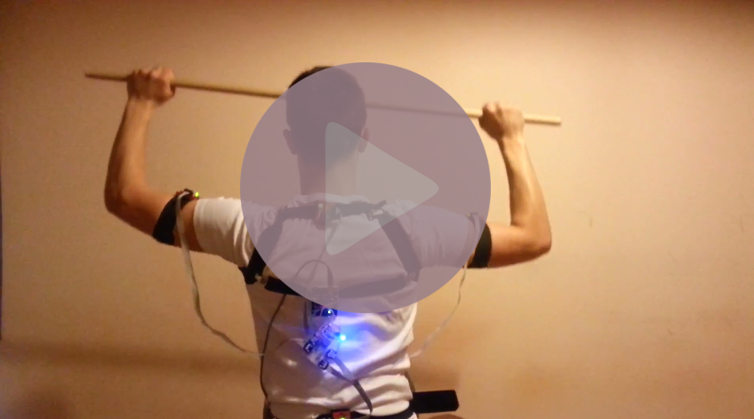

# Physical Exercise Monitor
 
The project has been created to serve the purpose as an engineering thesis.

- - -
1. [Descritpion](#descritpion)  
2. [Construction](#construction)  
3. [Electronic schematic](#electronic-schematic)  
4. [Demonstration (movie)](#demonstration)  
5. [Engineering dissertation topic](#engineering-dissertation-topic)
- - -

## 1\. Description

The aim of the engineering thesis was to create a device and an application, which would monitor the correct posture of the body during physical exercises. The thesis includes a description of the components on which the project was based. Using the Arduino platform as the main control unit, allows for an improvement and further development of the device for monitoring one's correct posture.

## 2\. Construction

The picture below shows the location of the  accelerometers and Arduino Uno.

  

-  Location of accelerometers
-  Location of Arduino Uno

## 3\. Electronic schematic

The device consists of:

 - Arduino Uno - as the control unit.
 - Adxl345 accelerometers - for calculating the inclination angles.
 - TCA9548A multiplexer - enables using more than two accelerometers.
 - Green LEDs - to notify if the accelerometer are properly powered.
 - Blue LED & buzzer - to notify users about their incorrect posture during physical exercise.

  

## 4\. Demonstration

Movie demonstrates the way in which the Physical Exercise Monitor works.

## 5\. Engineering dissertation topic

**Developing an application on a device in order to monitor the correct posture during physical exercises.**
